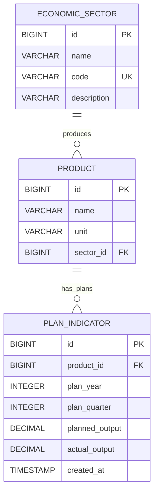

# Technical Documentation

## Database Design

### Entity Relationships Diagram



### Foreign Key Constraints

#### FK_PLAN_INDICATORS_PRODUCT
- **Table**: `plan_indicators`
- **Column**: `product_id`
- **References**: `products(id)`
- **Constraint Name**: `FKgo6941qp0lxot9p7wg3mkc7bn`

#### FK_PRODUCTS_SECTOR
- **Table**: `products`
- **Column**: `sector_id`
- **References**: `sectors(id)`
- **Constraint Name**: `FKa3innlukwa1f1def7w6kkpqyt`

## Application Startup Sequence

### 1. Spring Boot Initialization
```
2025-09-24T23:53:15.956+02:00 DEBUG [restartedMain] - Starting application
```

### 2. Database Schema Creation
Hibernate automatically creates tables based on JPA entities with `ddl-auto: create-drop`

### 3. Foreign Key Creation
```sql
-- Step 1: Create FK for plan_indicators -> products
ALTER TABLE plan_indicators 
ADD CONSTRAINT FKgo6941qp0lxot9p7wg3mkc7bn 
FOREIGN KEY (product_id) REFERENCES products;

-- Step 2: Create FK for products -> sectors  
ALTER TABLE products
ADD CONSTRAINT FKa3innlukwa1f1def7w6kkpqyt
FOREIGN KEY (sector_id) REFERENCES sectors;
```

### 4. Application Ready
Server starts on port 8080 with H2 console available

## Configuration Deep Dive

### Database Configuration Analysis

```yaml
spring:
  datasource:
    url: jdbc:h2:mem:econplan        # In-memory database named 'econplan'
    driver-class-name: org.h2.Driver # H2 JDBC driver
    username: sa                     # Default H2 username  
    password: password               # Default H2 password
```

**Memory Database Implications:**
- ✅ Fast startup and operations
- ✅ Perfect for development/testing
- ❌ Data lost on application restart
- ❌ Not suitable for production

### JPA/Hibernate Configuration

```yaml
spring:
  jpa:
    database-platform: org.hibernate.dialect.H2Dialect  # H2-specific SQL generation
    hibernate:
      ddl-auto: create-drop    # Schema lifecycle management
    show-sql: true            # SQL logging for debugging
    properties:
      hibernate:
        format_sql: true      # Pretty-print SQL in logs
```

**DDL Auto Options:**
- `create-drop`: Create schema on startup, drop on shutdown
- `create`: Create schema on startup, keep on shutdown
- `update`: Update schema if needed, keep data
- `validate`: Validate schema matches entities
- `none`: Do nothing

### Custom Configuration Properties

```yaml
economic-cybernetics:
  matrix:
    precision: 6           # Decimal places for matrix calculations
    max-iterations: 1000   # Convergence limit for iterative algorithms
  planning:
    default-quarters: 4    # Standard planning horizon
    base-year: 2025       # Reference year for economic models
```

## Logging Configuration

### Log Levels Explained

```yaml
logging:
  level:
    dev.nerobeev.economic_cybernetics_system: DEBUG  # Your application logs
    org.hibernate.SQL: DEBUG                         # SQL statement logs  
    org.hibernate.type.descriptor.sql.BasicBinder: TRACE  # SQL parameter logs
```

**Log Level Hierarchy**: TRACE < DEBUG < INFO < WARN < ERROR

### Sample Log Output

```
2025-09-24T23:53:15.956+02:00 DEBUG 12964 --- [economic-cybernetics-system] [restartedMain] org.hibernate.SQL: 
    alter table if exists plan_indicators 
       add constraint FKgo6941qp0lxot9p7wg3mkc7bn 
       foreign key (product_id) 
       references products
```

**Log Format Breakdown:**
- `2025-09-24T23:53:15.956+02:00` - ISO timestamp with timezone
- `DEBUG` - Log level
- `12964` - Process ID
- `[economic-cybernetics-system]` - Application name
- `[restartedMain]` - Thread name
- `org.hibernate.SQL` - Logger name
- SQL statement - Log message

## Mathematical Engine Architecture

### Matrix Operations with EJML

```java
// Example: Leontief Inverse Calculation

DMatrixRMaj I = CommonOps_DDRM.identity(n);           // Identity matrix
DMatrixRMaj A = new DMatrixRMaj(technicalCoeffs);     // Technical coefficients
DMatrixRMaj IMinusA = new DMatrixRMaj(n, n);          // I - A
//CommonOps_DDRM.subtract(I, A, IMinusA);               // Calculate I - A
DMatrixRMaj inverse = new DMatrixRMaj(n, n);          // Inverse matrix
//CommonOps_DDRM.invert(IMinusA, inverse);              // Calculate (I - A)^(-1)
```

### Precision Configuration

The `precision: 6` setting affects:
- Matrix calculation rounding
- Economic indicator storage
- Optimization convergence criteria
- Report formatting

### Performance Considerations

- **Memory Usage**: O(n²) for n×n matrices
- **Computation**: O(n³) for matrix inversion
- **Typical Sizes**: 10-100 economic sectors
- **Cache Strategy**: Results cached for repeated calculations

## Error Handling Strategy

### Database Errors
- Connection failures → Graceful degradation
- Constraint violations → Validation messages
- Transaction rollbacks → Data consistency

### Mathematical Errors
- Singular matrices → Alternative algorithms
- Convergence failures → Increased iterations
- Overflow/underflow → Precision adjustments

### API Errors
- Input validation → HTTP 400 responses
- Resource not found → HTTP 404 responses
- Server errors → HTTP 500 with logging